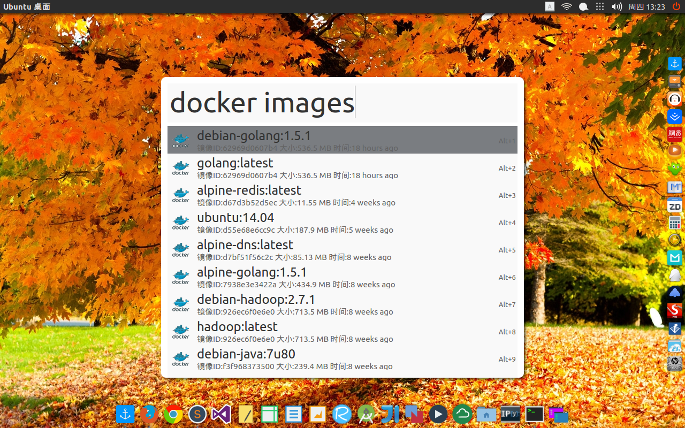

# mutate-docker
docker plugin for mutate (alfred app for linux) https://github.com/qdore/Mutate

## Prepare

0. install docker
1. install mutate

## Install (shotcut is Meta+D)

    git clone https://github.com/vmlinux/mutate-docker.git
    cp -r mutate-docker/docker ~/.config/Mutate/scripts/
    echo -e "[docker]\nScriptAddress=/home/$USER/.config/Mutate/scripts/docker/docker.sh\nIconAddress=/home/$USER/.config/Mutate/scripts/docker/docker.png\nHotKey=Meta+D\nArguments=need" >>~/.config/Mutate/config.ini

## Enjoy

**Available commands: images, ps, kill, rm:**

- click on list of images will create and run a temp container
- click on list of kill will kill container (of course)
- click on list of rm will remove container
- click on list of ps will do nothing

## License MIT
